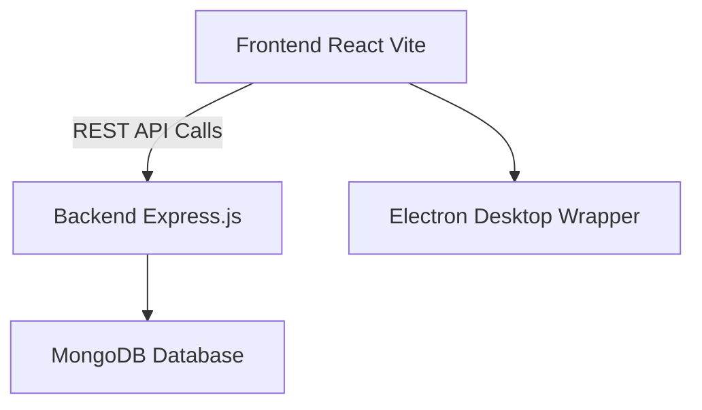

# 📚 Student Fee Management System  

[-61DAFB?logo=react&logoColor=white)](https://react.dev/)  
[](https://expressjs.com/)  
[](https://www.mongodb.com/)  
[](https://www.electronjs.org/)  
[](#)  

---

## 📌 Introduction  
The **Student Fee Management System** is a **full-stack application** designed to manage student fee records seamlessly.  
Built with **React (Vite)** for a fast, responsive frontend and **Express.js** for a secure backend, it connects to a **MongoDB database** for storing student data.  

The project also features **Electron integration**, allowing it to run as a **cross-platform desktop app**, enabling offline-friendly operations in addition to web access.  
Live Demo: Access the deployed static frontend at https://d3h9b9x8gvaf8b.cloudfront.net/.

> ⚠ **Note:** This project is currently in the development phase. Some features may be incomplete or buggy.

---

## 🗂 Project Structure
```
Student_Fee/          → Frontend (React + Vite)
DesktopApp/           → Electron wrapper for desktop version
Express-Backend/      → Backend API (Express + MongoDB)
```

---


## ⚡ Quick Start Diagram  



---

## 🚀 How to Run the Project  

### 1️⃣ Clone the Repository  
```bash
git clone <your-repo-url>
```

---

### 2️⃣ Setup Environment Variables  
Go to the **Student_Fee** directory:  
```bash
cd Student_Fee
```
Create a `.env` file:  
```env
VITE_API_STUDENTURL=http://localhost:3000/api/student
```
> Replace `student` with your MongoDB database name and update the URL to your MongoDB connection.

---

### 3️⃣ Running the Web Version  

#### Install dependencies:
```bash
npm install
```

#### Development mode:
```bash
npm run dev
```

#### Production build:
```bash
npm run build
npm start
```

---

### 4️⃣ Creating the Desktop App (Electron)  

From **Student_Fee** directory:
```bash
npm install
```

Switch to **DesktopApp** directory:
```bash
cd ..
cd DesktopApp
npm install
npm run build
```

The Electron desktop app build will be generated inside the **DesktopApp** directory.

---

### 5️⃣ Running the Backend Server  

Switch to **Express-Backend** directory:
```bash
cd ..
cd Express-Backend
npm install
node index.js
```

---

### 6️⃣ Final Step  
Run **both frontend (or Electron app)** and **backend server** before using the application.

---

## 🛠 Tech Stack
- **Frontend:** React (Vite), Tailwind CSS 
- **Backend:** Express.js, Node.js
- **Database:** MongoDB
- **Desktop Integration:** Electron.js

---

## 📌 Notes
- Ensure **MongoDB** is running before starting the backend.
- The `.env` file is **mandatory** for API connectivity.
- Project is still in **development**; expect changes.
